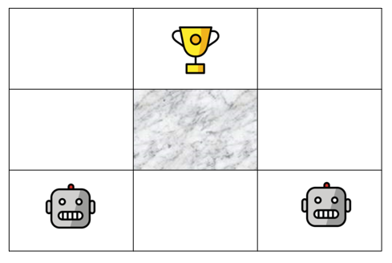
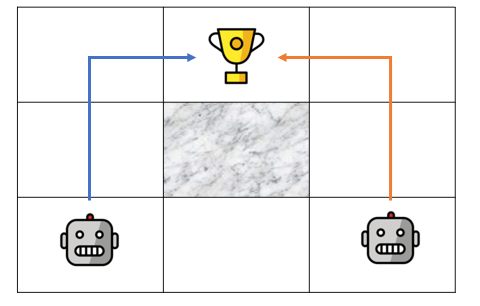

# Nash Q Learning 

Implementation of the Nash Q Learning  algorithm to solve games with two agents, as seen in the course Multiagent Systems @ PoliMi. 
The algorithm was first introduced in the paper [**Nash q-learning for general-sum stochastic games**](https://dl.acm.org/doi/10.5555/945365.964288) (Hu, J., Wellman, M.P., 2003).

## Example

Consider the following game where two robots need to reach the trophee. One obstacle lies in the middle of the grid. The two robots cannot be on the same tile at the same moment, except for the trophee's tile. See this [notebook](https://github.com/jtonglet/Nash_Q_Learning/blob/main/3-dim-example.ipynb) for a detailed walkthrough.





The robots and the game grid are represented by the Player and Grid objects. 

```python
from NashQLearn import Player, Grid
#Initialize the two players
player1 = Player([0,0])
player2 = Player([2,0])
#Initialize the grid
grid = Grid(length = 3,
            width = 3,
            players = [player1,player2],
            obstacle_coordinates = [[1,1]], 
            reward_coordinates = [1,2],
            reward_value = 20,
            collision_penalty = -1)
```

Once the game settings are defined, a NashQLearning object is initialized with the desired hyperparameters and trained on the grid. Available strategies are 'random', 'greedy', and 'epsilon-greedy'.

```python
from NashQLearn import NashQLearning
nashQ = NashQLearning(grid, 
                      max_iter = 2000,
                      discount_factor = 0.7,
                      learning_rate = 0.7,
                      epsilon = 0.5,
                      decision_strategy = 'epsilon-greedy')
#Retrieve the updated Q tables after fitting the algorithm
Q0, Q1 = nashQ.fit(return_history = False)
#Best path followed by each player given the values in the Q tables
p0, p1 = nashQ.get_best_policy(Q0,Q1)

#Show the results
print('Player 0 follows the  policy : %s of length %s.'%('-'.join(p0),len(p0)))
>>> Player 0 follows the  policy : up-up-right of length 3.
print('Player 1 follows the  policy : %s of length %s.'%('-'.join(p1),len(p1)))
>>> Player 1 follows the  policy : up-up-left of length 3.
```
In this case, the joint optimal policy was found by the algorithm, as shown on the figure below.



## Requirements

         
- python>=3.7
- numpy
- random
- tqdm
- collections
- nashpy
            
  
Nashpy is used to compute the Nash equilibrium for each stage game during the learning process.


